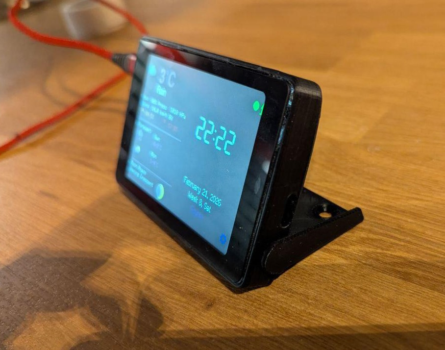

# Port of [DataDisplayV1](https://github.com/lachimalaif/DataDisplay-V1-instalator) for [WT32-SC01](https://en.wireless-tag.com/product-item-25.html)

Ported version: 1.4.

Only "clock view" was scaled to 480x320. Settings, etc remain at 320x240 so will display only on portion of the screen. 
Still, I was able to setup wifi without a stylus :)

I haven't removed firmware update detection and logic from the project. So don't update OTA as it will break everything, obviously.

## How to install

Use Arduino IDE to flash. Set board to ESP32 Wrover Module.

If you run into sketch size error change Partition Scheme in Arduino IDE:

Tools → Partition Scheme → "Huge APP (3MB No OTA/1MB SPIFFS)"

If you are looking for a stand to 3d print for this project I found these two:

https://www.printables.com/model/442876-wt32-sc01-dev-board-enclosure-with-standbatterycha



https://www.printables.com/model/135875-wt32-sc01-case

You might need to change rotation of the screen depending on which stand you want to use. 
This can be done in screen config in lgfx_wt32sc01.hpp 

```cpp
cfg.offset_rotation = 0;
```

change to 2 for 180 rotation.


